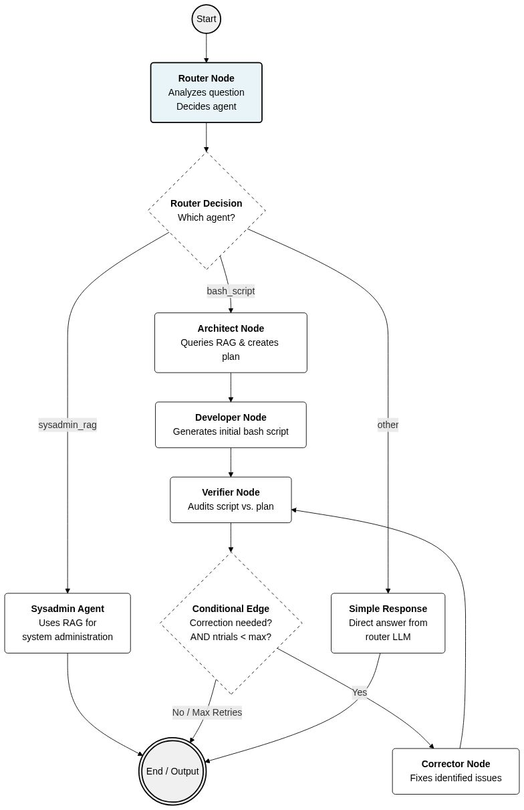

## Project Overview

**LINOS SysAdmin** is an LLM-powered Linux system administration agent that generates bash scripts and answers SysAdmin questions. It uses LangGraph for multi-agent orchestration with Ollama as the local LLM provider and Chroma vector stores for RAG.

The system routes user requests to two specialized pipelines:
1. **SysAdmin RAG Pipeline**: Answers Linux technical questions using embedded documentation
2. **Bash Script Generation Pipeline**: Creates and verifies bash scripts with multi-stage refinement

## Architecture & Data Flow

### Router Pattern (Entry Point)
- `app.py`: Single entry point with `router_decision()` that classifies queries into "sysadmin_rag", "bash_script", or "otro"
- Uses lightweight `ROUTER_PROMPT` with qwen2.5:1.5b for quick classification
- No RAG lookup needed for routing; separate LLM just for classification

### SysAdmin RAG Pipeline
- **File**: `graph/departments.py::sysadmin_agent()`
- **Flow**: User question → EnsembleRetriever (3 Chroma DBs) → Format docs → LLM chain → Markdown output
- **Retriever Setup** (`graph/rag_retrieve.py`):
  - 3 specialized vector stores: general sysadmin, networking, bash scripts
  - EnsembleRetriever with equal weights (1/3 each) - adjust weights in `rag_configuration()` if certain domains need priority
  - Each retriever pulls k=3 docs; adjust search_kwargs for different result counts
- **Key Detail**: Docs are formatted with metadata using `format_docs()` utility; sources are optional (user prompted)

### Bash Script Generation Pipeline (LangGraph Workflow)
- **File**: `graph/workflow.py` + `graph/nodes.py`
- **State Machine**: `AgentState` TypedDict maintains workflow data across nodes
- **4-Node Workflow** (architect → developer → verifier → [corrector → verifier loop] → END):
  1. **Arquitecto** (architect): Queries RAG for context, generates architectural plan
  2. **Desarrollador** (developer): Converts plan to executable bash script (extracts from ```bash blocks)
  3. **Verificador** (verifier): Audits script against plan; decides correction needed
  4. **Corrector** (corrector): Fixes issues identified by verifier
- **Safety Loop**: max 2 correction attempts (controlled by `ntrials` param in `decidir_siguiente_paso()`) to prevent infinite loops
- **Output Handling**: `bashScripting()` saves 3 artifacts (plan, original script, final script, verification report) with timestamps to `output_codes/`

## Key Development Patterns

### LLM Configuration
- Located in `app.py` (lines 6-9): Four separate ChatOllama instances by role
- Models: qwen2.5-coder:3b (planning/coding), qwen2.5:1.5b (routing)
- Each has tuned temperature/top_p/top_k for task (e.g., verifier uses T=0.0 for strict analysis)
- **Shared Pattern**: `keep_alive=0` to release resources between calls

### Prompt Structure
- All prompts in `graph/promts.py` (175 lines)
- Each role has explicit constraints (e.g., DEVELOPER_PROMPT: "return ONLY code block in ```bash")
- VERIFIER_PROMPT includes mandatory format (VEREDICTO, CUMPLIMIENTO, PROBLEMAS, SUGERENCIAS, CALIFICACIÓN)
- Correction detection: verifier response scanned for "REQUIERE_CORRECCIÓN" or "REQUIERE CORRECCIÓN" string

### Script Extraction Pattern
- Developer and Corrector nodes both use identical regex: `r"```(?:bash)?\n(.*?)```"` to extract code
- Fallback: if no backticks found, returns raw content as-is
- Applied in `nodo_desarrollador()` and `nodo_corrector()`

### Code Generation Context
- Architect node always queries RAG first; embeds retrieval results in the prompt to LLM
- This ensures scripts are grounded in documentation (e.g., specific flag combinations known to work)
- Retrieved doc metadata (pages) logged to console for transparency

## Critical Files & Their Roles

| File | Purpose |
|------|---------|
| `app.py` | Entry point; LLM config; router; loops until exit |
| `graph/workflow.py` | LangGraph StateGraph builder; conditional edge logic |
| `graph/nodes.py` | Four node functions (architect, developer, verifier, corrector) |
| `graph/agent_statet.py` | AgentState TypedDict - single source of truth for workflow state |
| `graph/rag_retrieve.py` | EnsembleRetriever initialization; 3 Chroma DB paths |
| `graph/promts.py` | All LLM prompts; update here for behavior changes |
| `graph/departments.py` | Entry points for both pipelines (sysadmin_agent, bashScripting) |
| `RAG/buildrag_embeddings.py` | Vector store building (not called by app; separate maintenance tool) |

## Common Tasks & Commands

### Running the Agent
```bash
python app.py
```
- Interactive REPL; type query → router classifies → executes pipeline
- Exit with: `salir`, `exit`, or `quit`
- Generated scripts saved to `output_codes/` with timestamp

### Adding New RAG Knowledge
1. Place documents in a source folder (not in vectors/)
2. Run `RAG/buildrag_embeddings.py` (requires updating hardcoded paths in that script)
3. Embeddings written to `vectors/vectores_sysadmin*` (Chroma DBs)
4. Automatic on next `rag_configuration()` call

### Tuning Model Behavior
- **Routing decisions**: Tweak `ROUTER_PROMPT` or model temperature in `app.py` line 9
- **Script quality**: Adjust DEVELOPER_PROMPT strictness or architect/developer LLM temperature/top_p
- **Correction sensitivity**: Modify verifier prompt keywords ("REQUIERE_CORRECCIÓN") or change ntrials in `decidir_siguiente_paso()`

### Debugging Workflow
- Console prints mark each node transition (ARQUITECTO, DESARROLLADOR, VERIFICADOR, CORRECTOR)
- Workflow state dumped to `output_codes/` files for post-mortem analysis
- Add `state` dict prints in nodes before returning to trace variable flow

## Project Conventions

1. **Spanish-First Code**: Variables, prompts, output messages in Spanish; English reserved for code logic/comments explaining "why"
2. **Timestamp Artifacts**: All bash script outputs timestamped (YYYYMMDDhhmmss); enables parallel runs and archival
3. **RAG Indexing by Domain**: Three separate Chroma stores instead of one—allows weighted retrieval adjustment per domain without re-embedding
4. **No Framework Auth**: Local Ollama backend; no API keys; assumes ollama server running on default port
5. **Markdown Output**: SysAdmin RAG writes to markdown; parsed with custom `render_mds()` function

## Integration Points & Dependencies

- **Ollama**: Local LLM backend; must be running with qwen2.5-coder:3b and qwen2.5:1.5b models loaded
- **LangChain**: Core chain/prompt/output parsing; v1.1.0 pinned
- **LangGraph**: Workflow orchestration; v1.0.4 pinned; uses StateGraph and conditional_edges
- **Chroma**: Vector store; persisted to disk; uses nomic-embed-text for embeddings
- **No external APIs**: Fully local except for initial model downloads from Ollama registry




---

**Last Updated**: December 3, 2025
